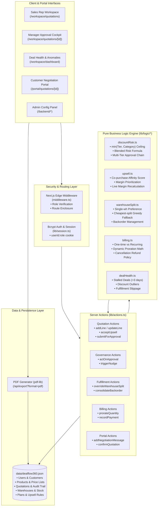
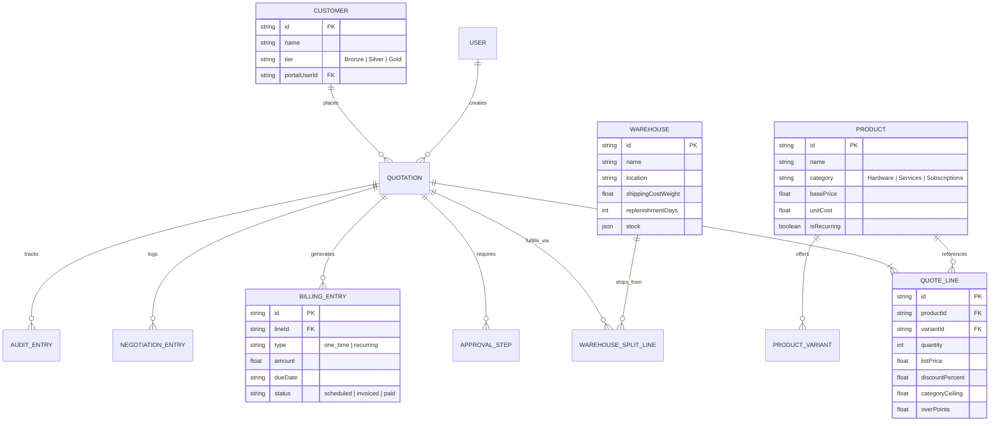

# DealFlow360 — Architecture Diagram & 5-Minute Demo Guide

This document fulfills the core hackathon deliverables specified in **Section 8 (Deliverables)** and **Section 9 (Quick Test Flow)** of the Odoo Hackathon Problem Statement.

---

## 1. One-Page Architecture Diagram

The DealFlow360 architecture is designed around pure, decoupled business logic (`lib/logic/*`), a unified relational JSON data store (`data/dealflow360.json`), and Next.js 14 App Router with Server Actions and Edge Middleware route protection.

---

## 2. Entity Relationship Data Model

---

## 3. Five-Minute Live Demo Script (8-Step Quick Test Flow)

This demo script matches the required hackathon test flow from **Section 9 & 11** of the specification:

### **Minute 0:00 – 1:00 | Intro & Setup**
1. Navigate to `http://localhost:3001/login`.
2. Notice the modern mesh gradient and the **⚡ Quick-Switch Demo Persona** panel.
3. Click on **Aditya Rao (Sales Rep)** — email and demo credentials populate automatically. Click **Sign in**.
4. You arrive on the Quotations Pipeline Kanban board. Click the **Reload Data** button in the header to ensure a pristine database state.

### **Minute 1:00 – 2:00 | Flow 1: Quote Building, Violation, & Live Upsell**
1. Click **+ New Quotation**. Select **Acme Corp — Gold** as customer and submit.
2. Under **+ Add Product to Quotation**:
   - Select **ProBook Laptop 14"** (Hardware). Notice the variant dropdown dynamically appears: select `RAM: 32GB Upgrade (+$150)`. Enter Quantity `2`, Discount `5%`. Click **+ Add Line**.
   - Notice the live line price includes the variant surcharge, and margin updates live.
3. In the right-hand **Upsell Recommendations** panel:
   - Notice the system recommends the **27" 4K Monitor** with `+$140.00 margin`.
   - Click **Add to Quote**. Total value and live gross margin percentage increase instantaneously.
4. Now add an intentional discount policy violation:
   - Select **On-site Setup Service** (Service). Enter Quantity `1`, Discount `18%`. Click **+ Add Line**.
   - Notice the line is flagged with **`+8 pts` over the 10% Services ceiling**.
5. Click **Confirm & Submit**. The quote status becomes **Pending Manager Approval**, and both Sales Manager and Finance steps are queued with a Blended Risk Score of `3.53 pts`.

### **Minute 2:00 – 3:00 | Flow 2: Multi-Step Approval & Warehouse Fulfillment**
1. Click **Close Workspace** to sign out.
2. On login, click **Karan Mehta (Sales Manager)** and sign in.
3. Open the pending quote (`quote-acme-001` or newly created quote). Under **Discount Governance & Multi-Step Approvals**, click **Approve**. The Manager step is marked approved, and the quote moves to **Pending Finance Approval**.
4. Log out and sign in as **Ritu Nair (Finance)**. Open the quote and click **Approve**.
5. Now approved, the **Multi-Warehouse Fulfillment Plan** generates automatically:
   - Hardware stock is automatically allocated across Main and East warehouses according to lowest shipping cost.
   - Click **Override Warehouse Split** to modify warehouse selection or click **Accept Suggested Split**.

### **Minute 3:00 – 4:00 | Flow 3: Customer Portal Negotiation & Auto Re-Approval**
1. As the sales rep, click **Send to Customer Portal**.
2. Log out and sign in as **Acme Corp Buyer (Customer Portal)** (`buyer@acme.com`).
3. You are restricted to `/portal` via Edge Middleware. Open the quotation.
4. Under **Review, Counter, or Execute Quotation**:
   - Request a bigger discount: enter Counter Discount `25%` and message `"Can you match our fiscal budget?"`.
   - Click **Confirm Quotation**.
5. The system dynamically re-evaluates the blended risk score with the new 25% discount, detects that the ceiling is exceeded, and **automatically re-enters the approval flow** instead of silently accepting.

### **Minute 4:00 – 5:00 | Flow 4: Hybrid Billing & Payment Reconciliation**
1. Log back in as **Karan Mehta** (Manager) and approve the counter-terms.
2. In the quote view, inspect the **Hybrid Billing Schedule**:
   - Hardware & setup services appear as one-time invoice entries.
   - Monthly recurring support plans generate current cycle + 3 upcoming billing installments.
3. On an invoiced line, click **Record Payment**. The status updates to **Paid**, and upon completing all required installments, the quote transitions to **Billed**.
4. Visit `/workspace/dashboard` to demonstrate the **Deal Health & Anomaly Feed** with 1-click **Send Nudge** triggers.
5. Visit `/workspace/reports` and click **Export PDF** to show the certified `pdf-lib` binary invoice download.

---

## 4. What We Would Build Next (Section 8 Deliverable)

1. **PostgreSQL Database with Row-Level Locking:**
   - Migrate from `data/dealflow360.json` to Prisma/PostgreSQL. Add optimistic locking (`@version` column) to prevent race conditions during concurrent sales negotiations.
2. **Webhook & Notification Integrations:**
   - Replace in-app nudges with real-time Slack/Teams incoming webhooks and SendGrid magic links for customer portal access.
3. **Dynamic ML Co-Purchase Mining:**
   - Derive the `coPurchaseScore` in `lib/logic/upsell.ts` dynamically from historical cart transactions rather than static heuristics.
4. **Multi-Currency Live FX:**
   - Implement real-time foreign exchange conversion and multi-company ledgers using the already modeled `currency` entity field.
